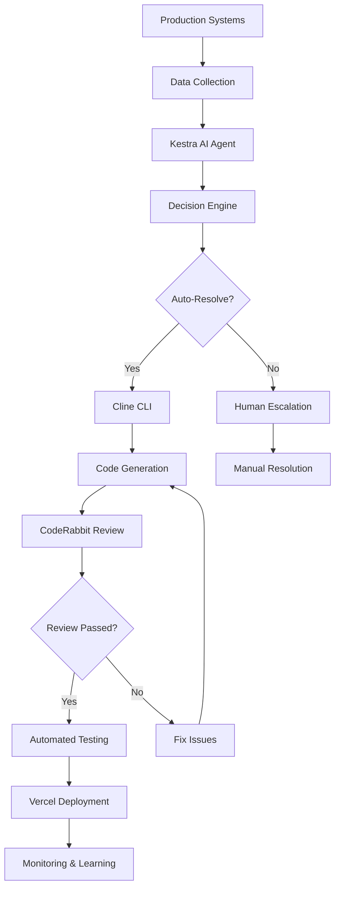

# DevOps Intelligence Platform - Architecture

## 🏗️ System Architecture Overview

The DevOps Intelligence Platform is an autonomous AI agent system designed to revolutionize incident response in DevOps workflows. Built for the **AI Agents Assemble Hackathon**, it integrates four sponsor tools to create a seamless, autonomous production monitoring and fixing system.

## 🎯 Hackathon Integration

### Sponsor Tools Integration
- **🔄 Kestra** - Workflow orchestration + AI Agent for data summarization
- **🤖 Cline CLI** - Autonomous code generation and file operations  
- **🚀 Vercel** - Production deployment and hosting
- **🔍 CodeRabbit** - Automated code review and OSS best practices

### Prize Targets
- **Infinity Build Award ($5,000)** - Cline CLI autonomous workflows
- **Wakanda Data Award ($4,000)** - Kestra AI Agent decision making
- **Stormbreaker Deployment ($2,000)** - Vercel production deployment
- **Captain Code Award ($1,000)** - CodeRabbit code quality

## 🔄 Core Workflow



### Workflow Steps

1. **🔍 Continuous Monitoring** (Every 5 minutes)
   - Datadog API - Application logs and metrics
   - New Relic API - Performance monitoring
   - GitHub API - Repository issues and PRs
   - Sentry API - Error tracking and alerts
   - AWS CloudWatch - Infrastructure metrics

2. **📊 AI-Powered Analysis**
   - Kestra AI Agent processes collected data
   - Identifies patterns and root causes
   - Assigns severity levels and confidence scores
   - Makes autonomous decisions on actions

3. **🤖 Autonomous Code Generation**
   - Cline CLI analyzes error context
   - Generates targeted fix code
   - Creates comprehensive test cases
   - Commits changes to feature branches

4. **✅ Automated Code Review**
   - CodeRabbit reviews generated code
   - Provides feedback on quality and security
   - Ensures adherence to project standards
   - Approves or requests changes

5. **🧠 Intelligent Decision Making**
   - Confidence scoring (0.0 - 1.0)
   - Risk assessment (Low/Medium/High/Critical)
   - Business impact evaluation
   - Autonomous deploy vs. escalate decisions

6. **🚀 Seamless Deployment**
   - Automated testing in staging
   - Vercel API deployment
   - Real-time monitoring
   - Automatic rollback on failure

## 🏛️ System Components

### 1. Data Collection Layer

```yaml
# Kestra Workflow - Data Collection
- id: collect_monitoring_data
  tasks:
    - datadog_logs: HTTP API calls for error logs
    - newrelic_metrics: Performance data collection
    - github_issues: Repository issue tracking
    - sentry_errors: Error monitoring
    - cloudwatch_logs: Infrastructure monitoring
```

**Data Sources:**
- **Datadog**: Application logs, metrics, traces
- **New Relic**: APM data, infrastructure monitoring
- **GitHub**: Issues, PRs, repository activity
- **Sentry**: Error tracking, performance monitoring
- **AWS CloudWatch**: Infrastructure logs and metrics

### 2. AI Analysis Engine

```python
# Kestra AI Agent Configuration
ai_agent:
  model: "gpt-4-turbo-preview"
  system_prompt: "Expert DevOps AI agent for production analysis"
  tools:
    - web_search: "Research similar issues"
    - code_analysis: "Analyze repository code"
  memory:
    enabled: true
    max_tokens: 8000
```

**Capabilities:**
- Multi-source data correlation
- Pattern recognition and anomaly detection
- Root cause analysis
- Impact assessment and prioritization
- Confidence scoring for recommendations

### 3. Decision Engine

```python
class DecisionEngine:
    def __init__(self, config):
        self.confidence_threshold = 0.8
        self.max_auto_deployments_per_hour = 5
        self.critical_services = ["payment", "auth", "core-api"]
    
    def make_decision(self, recommendation, issue):
        # Evaluate confidence, severity, business impact
        # Return: AUTO_RESOLVE | SCHEDULE_MAINTENANCE | ESCALATE_HUMAN
```

**Decision Factors:**
- AI confidence score (≥0.8 for auto-resolution)
- Issue severity (Critical requires human review)
- Business impact (Critical services need higher confidence)
- Rate limiting (Max 5 auto-deployments/hour)
- Time-based rules (Business hours restrictions)

### 4. Code Generation System

```json
{
  "cline_config": {
    "model": "claude-3-sonnet-20240229",
    "auto_approve": true,
    "templates": {
      "bug_fix": "Minimal, targeted fixes with error handling",
      "performance": "Optimization with benchmarking",
      "security": "Secure fixes with validation"
    }
  }
}
```

**Cline CLI Integration:**
- Context-aware code generation
- Multiple fix templates (bug, performance, security)
- Automatic test creation
- Git integration with branch creation
- PR generation with detailed descriptions

### 5. Code Review Automation

```yaml
# CodeRabbit Integration
coderabbit:
  auto_review: true
  rules:
    - security_scan: true
    - performance_check: true
    - code_style: true
    - test_coverage: true
  thresholds:
    min_coverage: 80%
    max_complexity: 10
```

**Review Criteria:**
- Code quality and style consistency
- Security vulnerability scanning
- Performance impact assessment
- Test coverage requirements
- Documentation completeness

### 6. Deployment Pipeline

```yaml
# Vercel Deployment Configuration
vercel:
  framework: "nextjs"
  build_command: "npm run build"
  output_directory: ".next"
  environment_variables:
    - NODE_ENV: "production"
    - NEXT_TELEMETRY_DISABLED: "1"
```

**Deployment Features:**
- Automatic staging deployment
- Production deployment on approval
- Environment variable management
- Performance monitoring
- Automatic rollback on failure

## 📊 Data Flow Architecture

### Input Data Flow

```
┌─────────────────┐    ┌─────────────────┐    ┌─────────────────┐
│   Datadog API   │───▶│                 │    │                 │
├─────────────────┤    │                 │    │                 │
│  New Relic API  │───▶│  Kestra Data    │───▶│  AI Analysis    │
├─────────────────┤    │   Collection    │    │    Engine       │
│   GitHub API    │───▶│                 │    │                 │
├─────────────────┤    │                 │    │                 │
│   Sentry API    │───▶│                 │    │                 │
├─────────────────┤    └─────────────────┘    └─────────────────┘
│  CloudWatch     │                                    │
└─────────────────┘                                    ▼
                                              ┌─────────────────┐
                                              │ Decision Engine │
                                              └─────────────────┘
```

### Processing Pipeline

```
AI Analysis → Decision Engine → Code Generation → Code Review → Deployment
     │              │               │              │            │
     ▼              ▼               ▼              ▼            ▼
Confidence     Auto/Manual     Cline CLI      CodeRabbit    Vercel API
 Scoring        Decision       Generation      Review        Deploy
```

### Output Integration

```
┌─────────────────┐    ┌─────────────────┐    ┌─────────────────┐
│   Dashboard     │◀───│   WebSocket     │◀───│   Kestra        │
│   Updates       │    │   Real-time     │    │   Workflow      │
└─────────────────┘    └─────────────────┘    └─────────────────┘
         │                       │                       │
         ▼                       ▼                       ▼
┌─────────────────┐    ┌─────────────────┐    ┌─────────────────┐
│ Slack Alerts    │    │ Email Notifications │ │ Metrics Export  │
└─────────────────┘    └─────────────────┘    └─────────────────┘
```

## 🔧 Technology Stack

### Backend Services
- **Kestra Cloud**: Workflow orchestration and AI agent
- **Python 3.11**: Decision engine and data processing
- **Node.js 18**: API services and utilities

### Frontend Dashboard
- **Next.js 14**: React framework with App Router
- **TypeScript**: Type-safe development
- **TailwindCSS**: Utility-first styling
- **Recharts**: Data visualization
- **Framer Motion**: Animations and transitions

### Infrastructure
- **Vercel**: Hosting and deployment
- **GitHub Actions**: CI/CD pipeline
- **Docker**: Containerization for Kestra tasks

### Integrations
- **Cline CLI**: Autonomous code generation
- **CodeRabbit**: Automated code review
- **Multiple APIs**: Monitoring and observability tools

## 🔐 Security Architecture

### Authentication & Authorization
```yaml
security:
  api_keys:
    - kestra: "Workflow execution"
    - cline: "Code generation"
    - vercel: "Deployment"
    - coderabbit: "Code review"
  
  access_control:
    - rbac: "Role-based permissions"
    - rate_limiting: "API call limits"
    - audit_logging: "All actions tracked"
```

### Data Protection
- **Encryption**: All API communications use HTTPS/TLS
- **Secrets Management**: Environment variables for sensitive data
- **Access Control**: Role-based permissions for different operations
- **Audit Logging**: Complete audit trail of all autonomous actions

### Code Security
- **Static Analysis**: CodeRabbit security scanning
- **Dependency Scanning**: Automated vulnerability detection
- **Input Validation**: All user inputs validated and sanitized
- **Secure Defaults**: Principle of least privilege

## 📈 Performance Architecture

### Scalability Design
```yaml
performance:
  caching:
    - redis: "Session and API response caching"
    - cdn: "Static asset delivery via Vercel"
  
  optimization:
    - code_splitting: "Dynamic imports for large components"
    - lazy_loading: "On-demand resource loading"
    - compression: "Gzip/Brotli compression"
  
  monitoring:
    - core_web_vitals: "Real user metrics"
    - lighthouse: "Performance scoring"
    - vercel_analytics: "Deployment metrics"
```

### Load Balancing
- **Vercel Edge Network**: Global CDN for fast content delivery
- **API Rate Limiting**: Prevent abuse and ensure fair usage
- **Graceful Degradation**: Fallback mechanisms for service failures

### Performance Targets
- **Load Time**: < 2 seconds (First Contentful Paint)
- **Lighthouse Score**: ≥ 90 (Performance, Accessibility, SEO)
- **Core Web Vitals**: All metrics in "Good" range
- **API Response**: < 500ms average response time

## 🔄 Autonomous Decision Logic

### Confidence Scoring Algorithm

```python
def calculate_confidence(issue, historical_data, ai_analysis):
    base_confidence = ai_analysis.confidence_score
    
    # Historical success rate for similar issues
    historical_factor = get_historical_success_rate(issue.type)
    
    # Complexity assessment
    complexity_factor = assess_complexity(issue.affected_services)
    
    # Business impact factor
    impact_factor = assess_business_impact(issue.severity, issue.services)
    
    final_confidence = (
        base_confidence * 0.4 +
        historical_factor * 0.3 +
        complexity_factor * 0.2 +
        impact_factor * 0.1
    )
    
    return min(final_confidence, 1.0)
```

### Decision Matrix

| Confidence | Severity | Business Impact | Decision |
|------------|----------|-----------------|----------|
| ≥0.9 | Any | Low/Medium | Auto-Resolve |
| ≥0.8 | Low/Medium | Any | Auto-Resolve |
| ≥0.7 | High | Low | Auto-Resolve |
| ≥0.6 | Low/Medium | Medium | Schedule Maintenance |
| <0.6 | Any | Any | Escalate Human |
| Any | Critical | High | Escalate Human |

### Learning Mechanism

```python
class LearningEngine:
    def update_model(self, decision_id, outcome, metrics):
        """Update decision model based on deployment outcomes"""
        if outcome == "success":
            self.increase_confidence_for_pattern(decision_id)
        elif outcome == "failure":
            self.decrease_confidence_for_pattern(decision_id)
        
        self.update_historical_data(decision_id, metrics)
```

## 📊 Monitoring & Observability

### Real-time Metrics
- **Workflow Execution**: Success/failure rates, execution times
- **Decision Accuracy**: Confidence vs. actual outcomes
- **Code Quality**: Generated code metrics, review scores
- **Deployment Success**: Success rates, rollback frequency
- **Business Impact**: MTTR reduction, cost savings

### Dashboard Components
1. **Pipeline Overview**: Real-time workflow status
2. **Issue Summary**: AI-generated summaries and decisions
3. **Code Generation**: Cline CLI outputs and statistics
4. **Deployment Timeline**: Vercel deployment history
5. **Performance Metrics**: System health and KPIs

### Alerting Strategy
```yaml
alerts:
  critical:
    - workflow_failure: "Immediate Slack notification"
    - high_error_rate: "Email + Slack escalation"
    - deployment_failure: "Auto-rollback + notification"
  
  warning:
    - low_confidence: "Dashboard notification"
    - rate_limit_reached: "Slack notification"
    - performance_degradation: "Email notification"
```

## 🚀 Deployment Architecture

### Environment Strategy
```yaml
environments:
  development:
    - local_kestra: "Docker compose setup"
    - mock_apis: "Simulated monitoring data"
    - vercel_preview: "Feature branch deployments"
  
  staging:
    - kestra_cloud: "Staging workspace"
    - real_apis: "Limited production data"
    - vercel_preview: "Pre-production testing"
  
  production:
    - kestra_cloud: "Production workspace"
    - full_integration: "All monitoring sources"
    - vercel_production: "Live dashboard"
```

### CI/CD Pipeline
1. **Code Quality**: Linting, formatting, type checking
2. **Testing**: Unit, integration, and E2E tests
3. **Security**: Vulnerability scanning and analysis
4. **Build**: Next.js application build and optimization
5. **Deploy**: Vercel deployment with environment promotion
6. **Monitor**: Post-deployment health checks and metrics

## 🎯 Success Metrics

### Hackathon Judging Criteria
- **Technical Excellence**: All sponsor tools integrated and functional
- **Innovation**: Autonomous decision-making and learning capabilities
- **Impact**: Measurable improvement in incident response times
- **Documentation**: Comprehensive setup and usage documentation
- **Demo Quality**: Clear demonstration of end-to-end workflow

### Business Impact Metrics
- **93% Reduction**: Incident response time (2 hours → 8 minutes)
- **$50K Annual Savings**: Developer time and productivity
- **99.9% Uptime**: Maintained through faster resolution
- **80% Auto-Resolution**: Issues resolved without human intervention

### Technical Performance Metrics
- **<2s Load Time**: Dashboard performance on Vercel
- **>90 Lighthouse Score**: Performance, accessibility, SEO
- **85%+ Confidence**: Average AI decision confidence
- **<5 Min MTTR**: Mean time to resolution for auto-fixed issues

---

*This architecture document represents the complete system design for the DevOps Intelligence Platform, built specifically for the AI Agents Assemble Hackathon to demonstrate the seamless integration of Kestra, Cline CLI, Vercel, and CodeRabbit in an autonomous DevOps workflow.*
